# 短链接系统架构文档

## 1. 项目概述

本项目是一个基于 Go-Zero 微服务框架的高性能短链接生成系统，支持分布式部署、高并发访问和智能缓存。系统采用前后端分离架构，提供完整的短链接生成、跳转、管理功能。

## 2. 整体架构设计

### 2.1 系统架构图

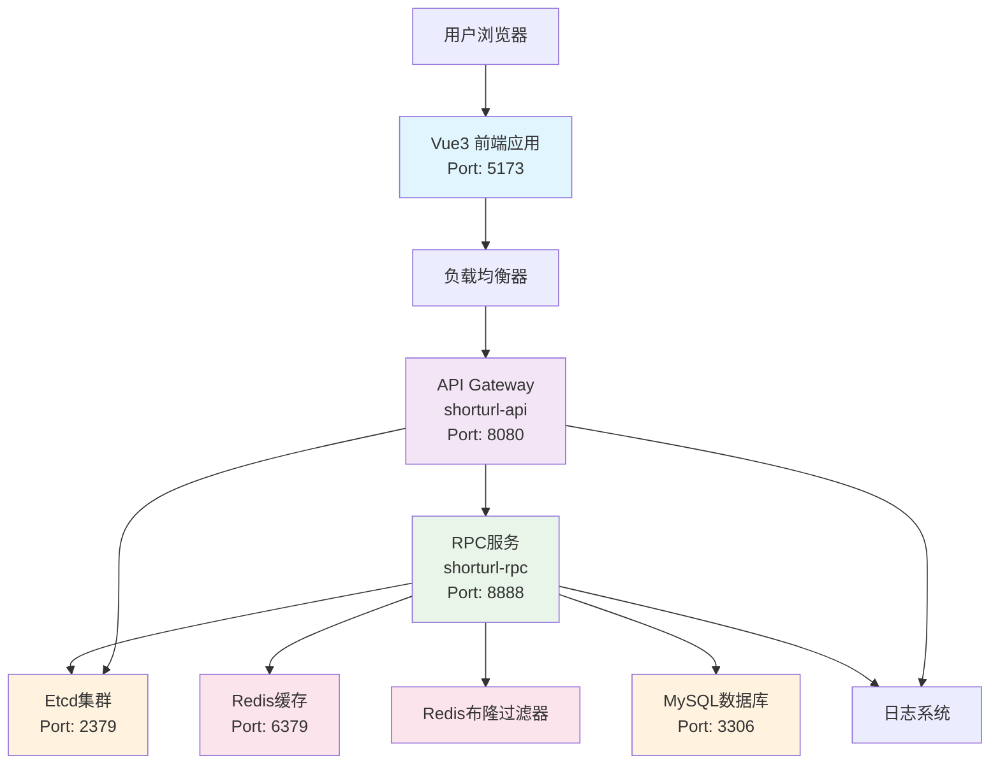

### 2.2 技术栈

#### 前端技术栈
- **Vue 3**: 渐进式JavaScript框架
- **Vite**: 现代化构建工具
- **Axios**: HTTP客户端库
- **CSS3**: 现代化样式设计

#### 后端技术栈
- **Go-Zero**: 微服务框架
- **gRPC**: 高性能RPC通信
- **Gin**: HTTP Web框架（单体版本）
- **GORM**: ORM数据库操作
- **Protobuf**: 数据序列化

#### 基础设施
- **MySQL**: 关系型数据库
- **Redis**: 内存缓存数据库
- **Etcd**: 服务发现与配置中心
- **Docker**: 容器化部署

## 3. 微服务架构详解

### 3.1 服务拆分

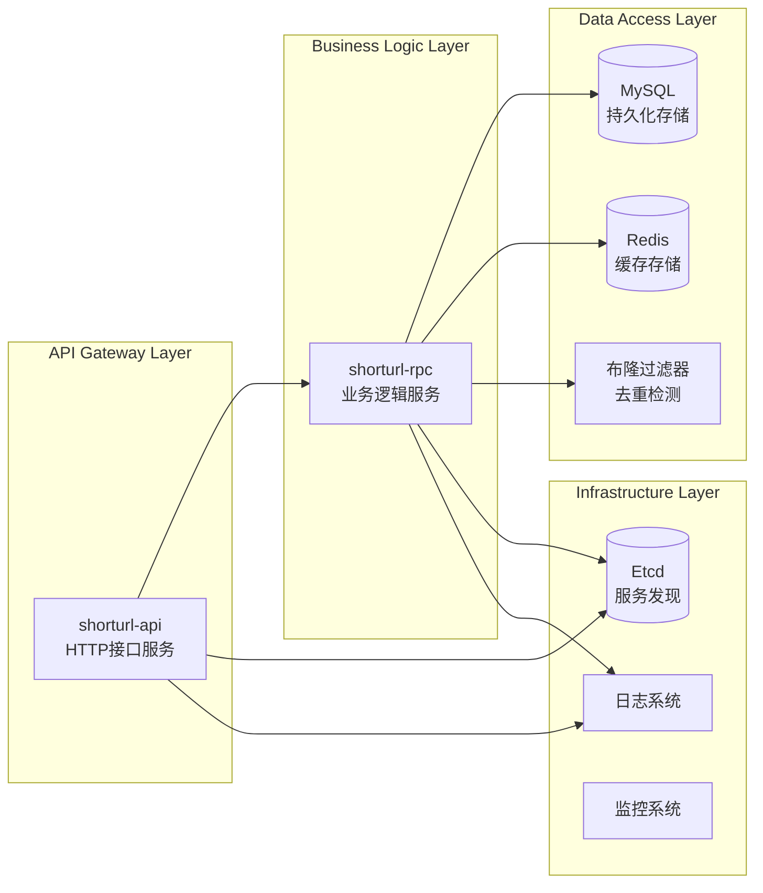

### 3.2 服务通信

#### gRPC 接口定义

```protobuf
service ShortUrl {
    // 生成短链接
    rpc GenerateShortUrl(GenerateShortUrlRequest) returns (GenerateShortUrlResponse);
    // 处理短链接跳转
    rpc HandleShort(HandleShortRequest) returns (HandleShortResponse);
}
```

## 4. 核心业务流程

### 4.1 短链接生成流程

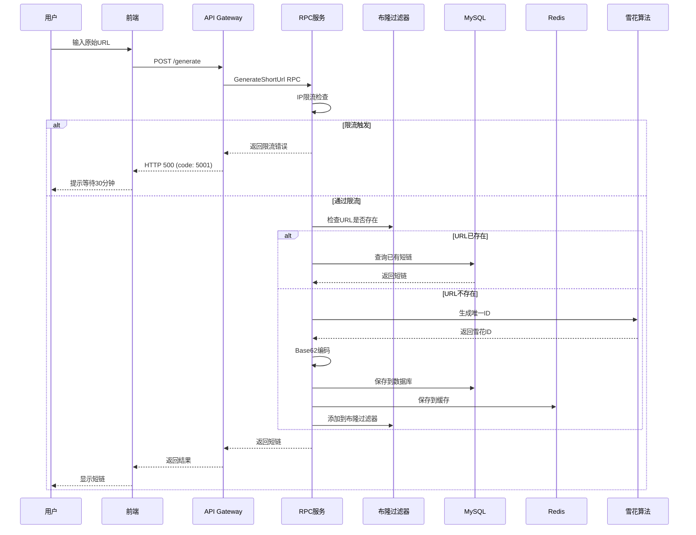

### 4.2 短链接跳转流程

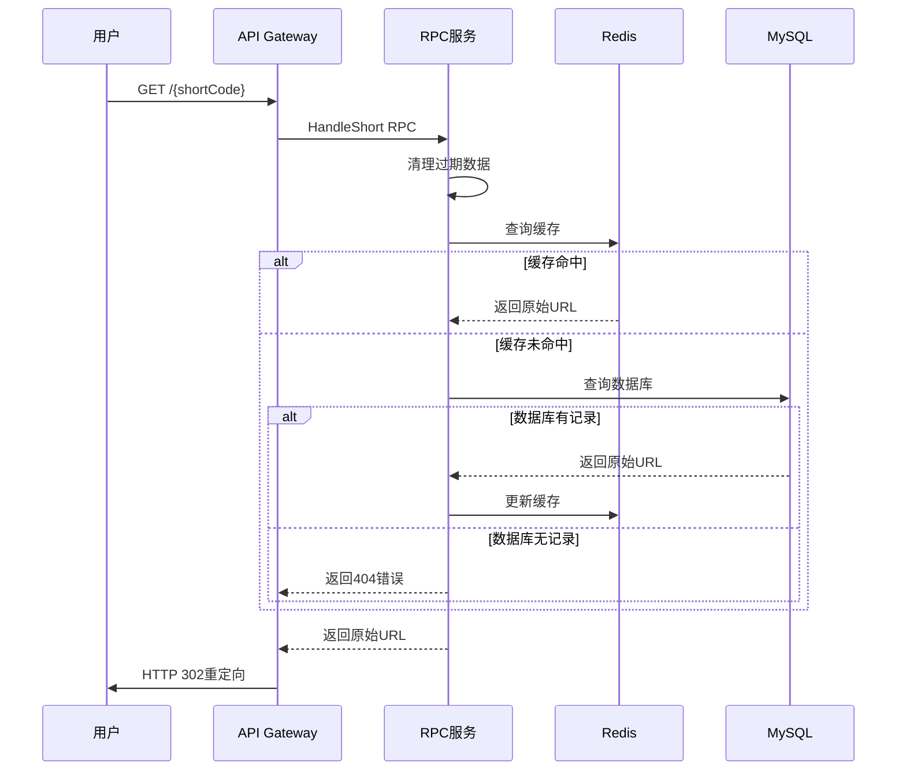

## 5. 核心组件设计

### 5.1 雪花算法ID生成器

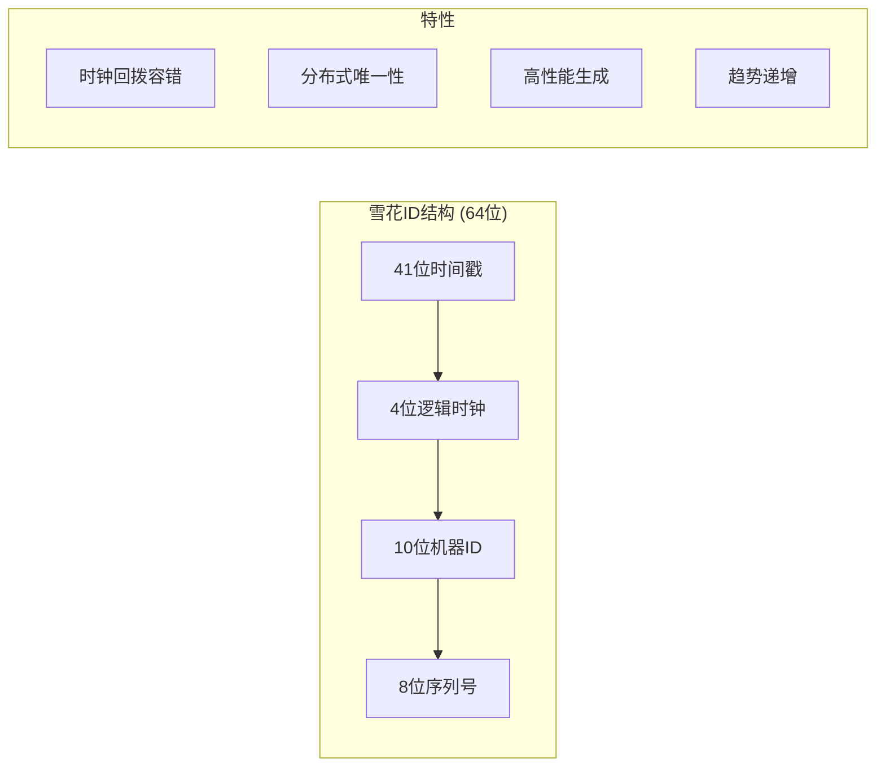

**设计特点：**
- 支持时钟回拨容错机制
- 机器ID范围：0-1023
- 每毫秒可生成256个ID
- 理论上可使用69年

### 5.2 布隆过滤器

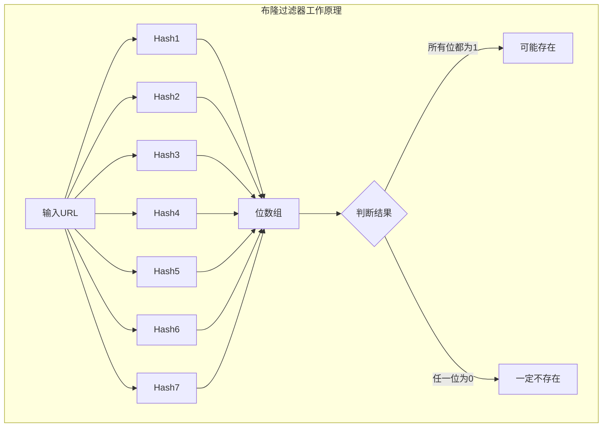

**配置参数：**
- 预期元素数量：1,000,000
- 误判率：1%
- 哈希函数：7个（MD5 + SHA1组合）
- 存储方式：Redis BF模块

### 5.3 缓存策略

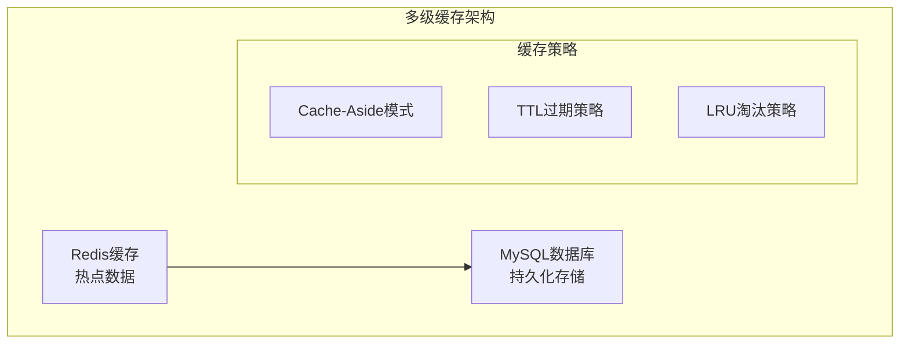

## 6. 数据模型设计

### 6.1 数据库表结构

```sql
CREATE TABLE `shorturl` (
  `id` bigint(20) unsigned NOT NULL COMMENT '雪花算法生成的唯一ID',
  `created_at` datetime(3) DEFAULT NULL COMMENT '创建时间',
  `updated_at` datetime(3) DEFAULT NULL COMMENT '更新时间',
  `deleted_at` datetime(3) DEFAULT NULL COMMENT '删除时间',
  `shorturl` varchar(20) NOT NULL COMMENT '短链接代码',
  `url` varchar(200) NOT NULL COMMENT '原始URL',
  PRIMARY KEY (`id`),
  KEY `idx_shorturl_deleted_at` (`deleted_at`),
  KEY `idx_shorturl_shorturl` (`shorturl`),
  KEY `idx_shorturl_url` (`url`)
) ENGINE=InnoDB DEFAULT CHARSET=utf8mb4 COMMENT='短链接映射表';
```

### 6.2 Redis数据结构

```
# 短链接缓存
KEY: {shortCode}
VALUE: {originalURL}
TTL: 24小时

# 布隆过滤器
KEY: shorturl:Bloom
TYPE: BF (Redis Bloom Filter)
```

## 7. 性能优化设计

### 7.1 性能优化策略

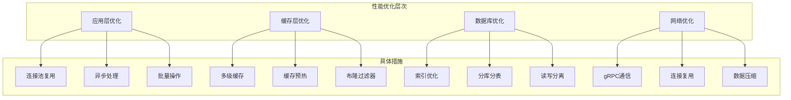

### 7.2 限流保护

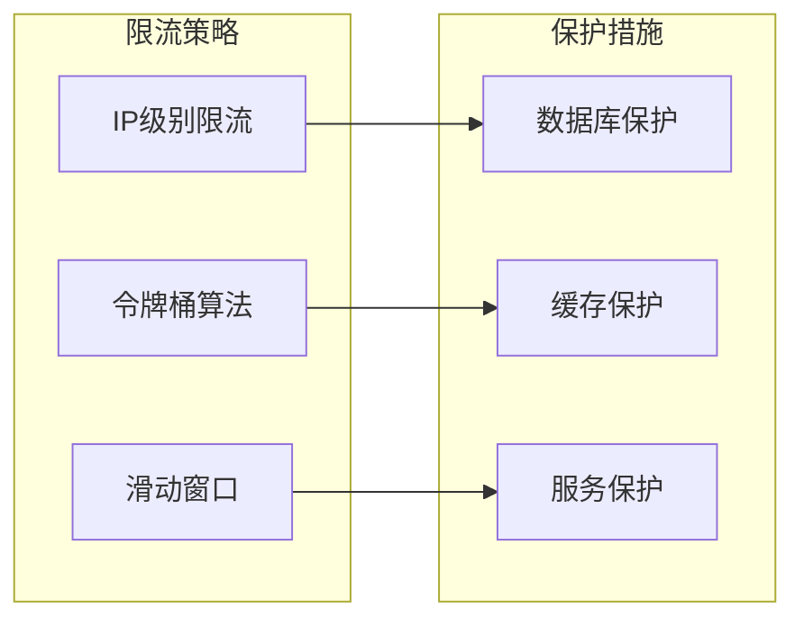

## 8. 监控与运维

### 8.1 监控体系

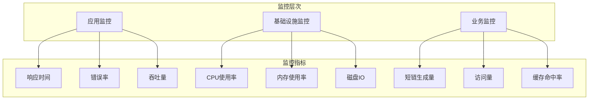

### 8.2 日志系统

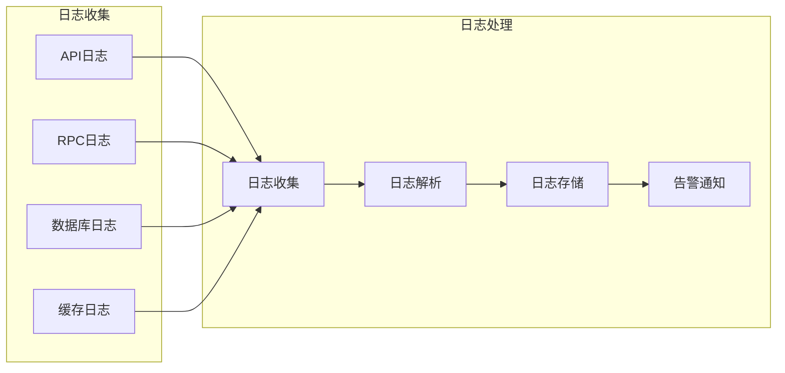

## 9. 部署架构

### 9.1 容器化部署

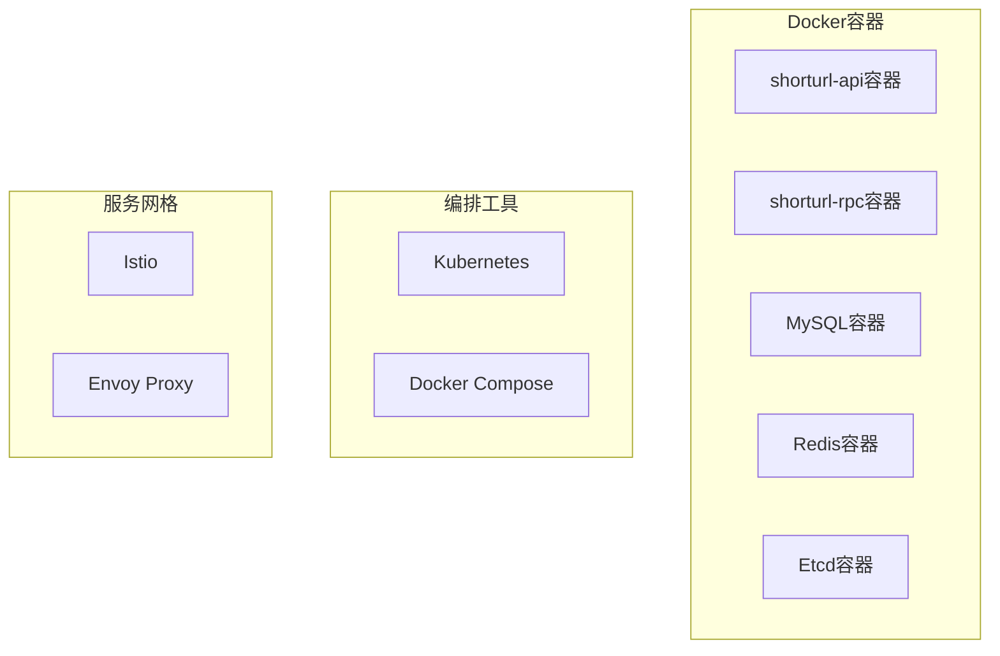

### 9.2 高可用部署

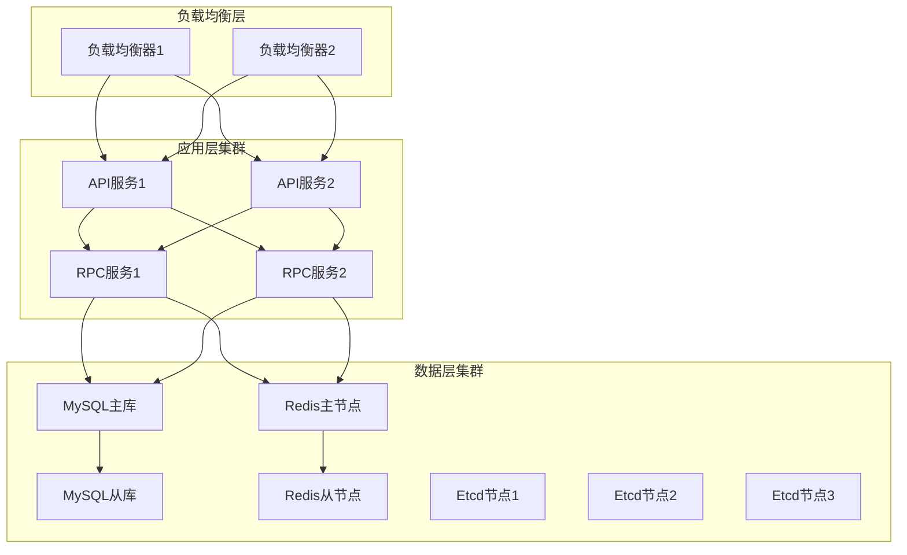

## 10. 安全设计

### 10.1 安全防护

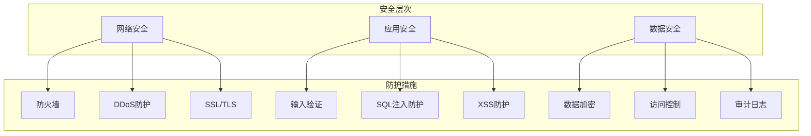

## 11. 扩展性设计

### 11.1 水平扩展

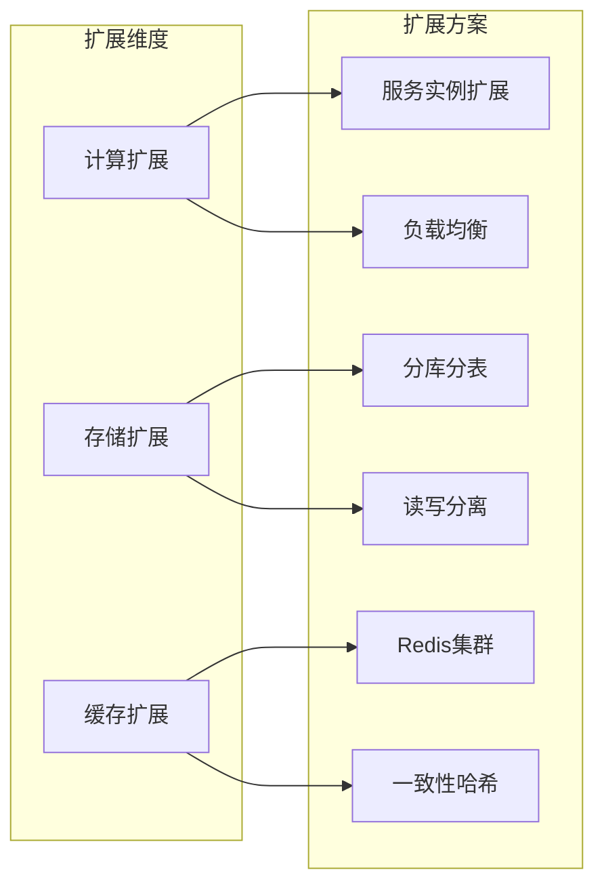

## 12. 配置管理

### 12.1 配置文件结构

```yaml
# API服务配置
Name: shorturl-api
Host: 0.0.0.0
Port: 8080
ShortUrlRpc:
  Etcd:
    Hosts:
      - 127.0.0.1:2379
    Key: shorturl.rpc

# RPC服务配置
Name: shorturl.rpc
ListenOn: 0.0.0.0:8888
Etcd:
  Hosts:
    - 127.0.0.1:2379
  Key: shorturl.rpc
Mysql:
  DbUser: root
  DbPort: "3306"
  DbPass: root
  DbName: shorturl
  DbHost: localhost
BizRedis:
  RedisHost: 127.0.0.1
  RedisPort: "6379"
  RedisPass: ""
  RedisDB: 0
```

## 13. 总结

本短链接系统采用现代化的微服务架构设计，具备以下核心优势：

1. **高性能**: 通过多级缓存、布隆过滤器、雪花算法等技术实现高性能
2. **高可用**: 微服务架构支持服务独立部署和故障隔离
3. **可扩展**: 支持水平扩展，可根据业务需求灵活调整
4. **易维护**: 清晰的分层架构和标准化的开发规范
5. **安全可靠**: 完善的安全防护和监控体系

系统设计充分考虑了互联网应用的特点，能够支撑大规模用户访问和高并发场景，为业务发展提供稳定可靠的技术支撑。